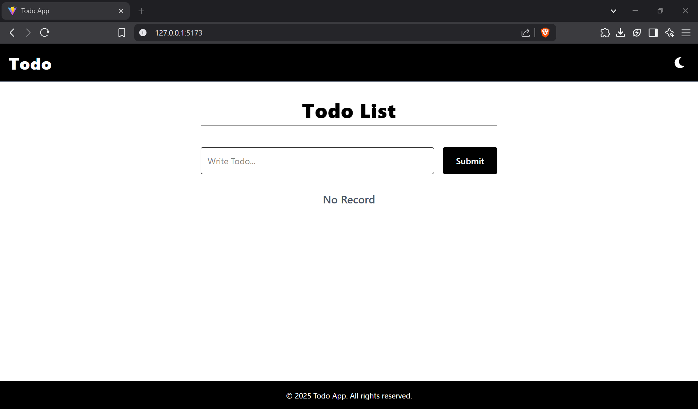
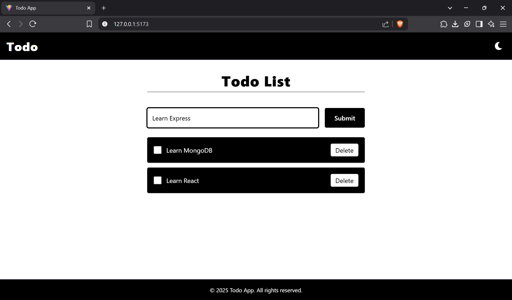
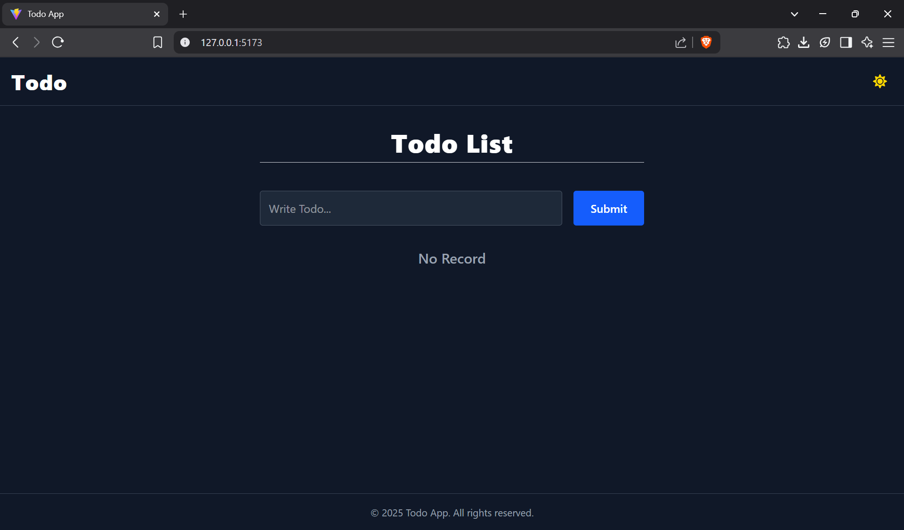
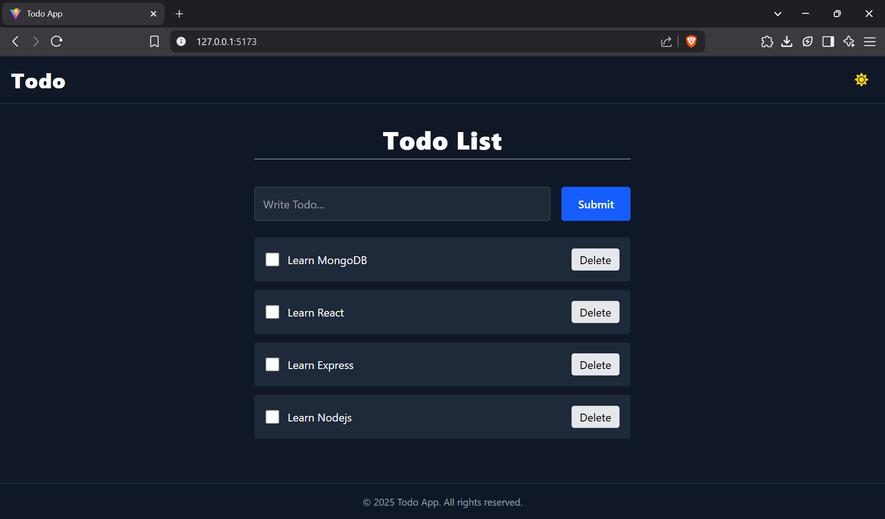

# React Todo App

A simple and elegant Todo application built using the **MERN stack** (MongoDB, Express.js, React, and Node.js). This app allows users to manage their tasks efficiently with features like adding, deleting, and marking tasks as completed. It also includes a dark mode toggle for a better user experience.

## Features

- **Add Todos**: Create new tasks to keep track of your to-dos.
- **Mark as Completed**: Check off tasks when they are done.
- **Delete Todos**: Remove tasks that are no longer needed.
- **Dark Mode**: Toggle between light and dark themes for better accessibility.
- **Responsive Design**: Fully responsive and works seamlessly on all devices.

## Tech Stack

- **Frontend**: React.js, Tailwind CSS
- **Backend**: Node.js, Express.js
- **Database**: MongoDB
- **HTTP Client**: Axios

## Project Structure

```
React-Todo-App/
├── client/                # Frontend code
│   ├── public/            # Static assets
│   ├── src/               # React components and logic
│   │   ├── components/    # Reusable components (Header, Footer, etc.)
│   │   ├── App.jsx        # Main React component
│   │   ├── main.jsx       # React entry point
│   │   └── index.css      # Global styles
│   └── package.json       # Frontend dependencies
├── server/                # Backend code
│   ├── models/            # Mongoose models
│   │   └── Todo.js        # Todo schema
│   ├── index.js           # Express server entry point
│   └── package.json       # Backend dependencies
├── .gitignore             # Files to ignore in Git
├── README.md              # Project documentation
└── .env                   # Environment variables (not included in repo)
```

## Installation

### Prerequisites

- Node.js (v14 or higher)
- MongoDB (running locally or on a cloud service like MongoDB Atlas)
- Git

### Steps

1. Clone the repository:

   ```bash
   git clone https://github.com/xitesh/React-Todo-App.git
   cd React-Todo-App
   ```

2. Install dependencies for both the client and server:

   ```bash
   # Install server dependencies
   cd server
   npm install

   # Install client dependencies
   cd ../client
   npm install
   ```

3. Set up environment variables:

   Create a `.env` file in the `server` directory with the following content:

   ```
   MONGO_URI=your_mongodb_connection_string
   PORT=3000
   ```

   Replace `your_mongodb_connection_string` with your MongoDB connection string.

4. Start the development servers:

   ```bash
   # Start the backend server
   cd server
   npm start

   # Start the frontend development server
   cd ../client
   npm run dev
   ```

5. Open the app in your browser:

   The frontend will be running at [http://localhost:5173](http://localhost:5173), and the backend API will be available at [http://localhost:3000](http://localhost:3000).

## API Endpoints

### Base URL: `http://localhost:3000`

- **GET /get**: Fetch all todos.
- **POST /create**: Create a new todo.
- **PUT /update/:id**: Update the status of a todo (mark as completed).
- **DELETE /delete/:id**: Delete a todo.

## Screenshots

### Light Mode




### Dark Mode




## Contributing

Contributions are welcome! To contribute:

1. Fork the repository.
2. Create a new branch for your feature or bug fix.
3. Commit your changes and push them to your fork.
4. Submit a pull request.

## License

This project is licensed under the MIT License. See the [LICENSE](LICENSE) file for details.

## Acknowledgments

- [React Icons](https://react-icons.github.io/react-icons/) for the theme toggle icons.
- [Tailwind CSS](https://tailwindcss.com/) for the beautiful styling.

---